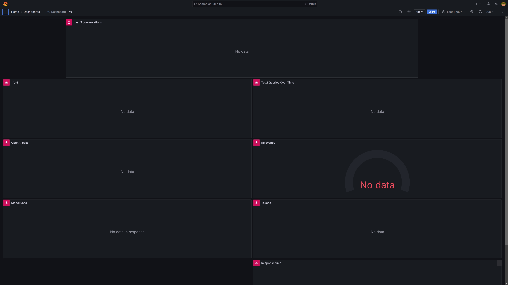
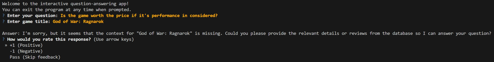
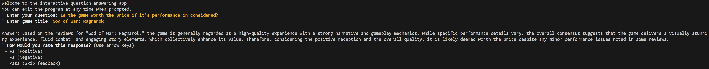
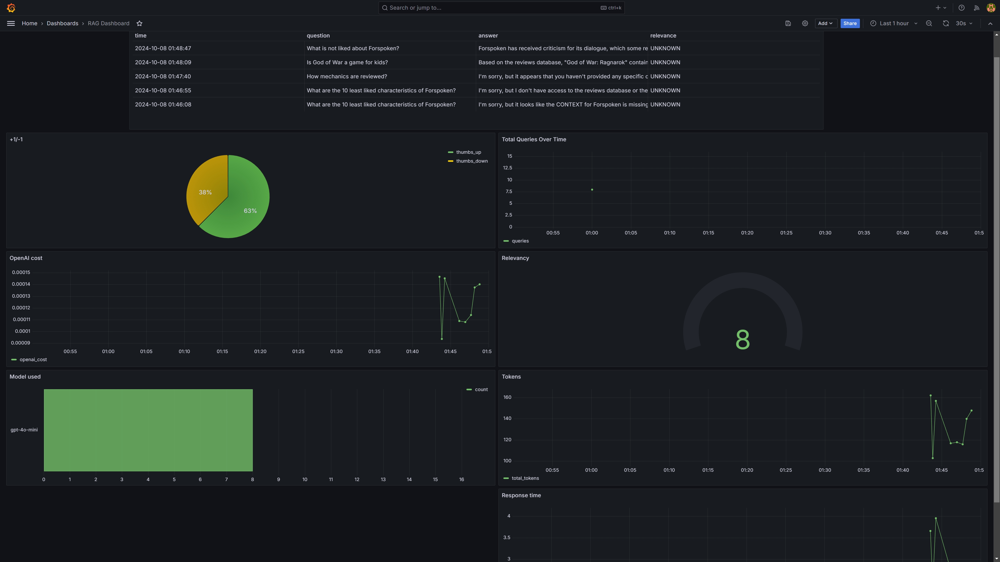

# Hello there, Traveler. Take a seat and ask about the game you'd like..
## The Quest

This repository contains the final project for the [LLM Zoomcamp](https://github.com/DataTalksClub/llm-zoomcamp) course provided by [DataTalks.Club](https://datatalks.club/).

The primary objective of this project is to apply the knowledge and skills acquired throughout the course. The focus is on constructing a Retrieval-Augmented Generation (RAG) application, which will enhance the generative capabilities of a selected LLM in providing answers to user queries about computer games. For example, if a new game like God of War: Ragnarok has just been released, a user might ask our RAG application for opinions about the game's general state. Based on the responses, the user could decide whether to buy the game immediately or wait until the price drops or bugs from the initial release are fixed.

## The Landscape
In essence, a RAG application enhances the capabilities of pre-trained, widely available language models (LLMs) by incorporating a Knowledge Base (KB). This Knowledge Base acts as a repository of information that the LLM can access whenever a query is made. Essentially, when a query is sent to the LLM, the response is strengthened by the locally maintained Knowledge Base, creating a symbiotic relationship that any organization can cultivate within its own environment.

To build a RAG (Retrieval-Augmented Generation) application, [Elastisearch](https://www.elastic.co/docs) is utilized as the Knowledge Base, providing powerful indexing and search capabilities. For operationalizing the application's usage, a combination of [Flask](https://flask.palletsprojects.com/en/3.0.x/), [Grafana](https://grafana.com/docs/grafana/latest/), and [PostgreSQL](https://www.postgresql.org/) is employed. Flask serves as the backend framework, handling the API endpoints and routing requests, while Grafana is used for monitoring and visualizing system metrics, ensuring smooth performance and quick identification of issues. PostgreSQL functions as the database solution for storing and managing user activities, including feedback on whether the answers provided by the RAG application were meaningful. This enables reliable and efficient data persistence, ensuring that all interactions and feedback are recorded and easily accessible for future analysis. The integrated stack ensures that the application remains maintainable, delivering a comprehensive solution for handling RAG-based queries.

## The Lore
The architectural overview of the project is depicted in the diagram below, providing a high-level perspective of the system's design and interactions.


### Applied Technologies

| Name                   | Scope                                       | Description                                                                                                         |
| ----------------------| ------------------------------------------ | ------------------------------------------------------------------------------------------------------------------- |
| Docker Desktop         | Continuous integration, local development, containerization | Docker Desktop is a platform that enables the development, shipping, and running of applications within containers.  |
| Jupyter Lab            | Interactive computing, data analysis       | Jupyter Lab is an open-source web application that provides a flexible interface for working with Jupyter notebooks, code, and data, making it ideal for interactive computing and data analysis. |
| Elasticsearch         | Search engine, analytics                   | Elasticsearch is a distributed search and analytics engine built on Apache Lucene, designed for horizontal scalability, reliability, and real-time search capabilities. |
| Flask                  | Web framework                              | Flask is a lightweight WSGI web application framework for Python that provides the tools and libraries to build web applications quickly and with minimal overhead. |
| Grafana                | Monitoring, visualization                  | Grafana is an open-source platform for monitoring and observability that allows users to visualize metrics from various data sources through customizable dashboards. |
| PostgreSQL             | RDBMS                                      | PostgreSQL is an open-source relational database management system (RDBMS) known for its reliability, robustness, and extensive feature set, commonly used for storing structured data. |
| Pipenv                 | Dependency management                      | Pipenv is a tool that simplifies dependency management for Python projects by creating a virtual environment and managing package installations in a unified manner. |
| OpenAI ChatGPT-4 Mini | Natural language processing, conversational AI | OpenAI ChatGPT-4 Mini is a smaller, optimized version of the ChatGPT model designed for generating human-like text responses in conversational contexts. |


## How to kill a dragon each time the same way
### Pre-requisties

* Python 3.10 or above
* Docker Desktop
* allowed virtualization in BIOS
* OpanAI API KEY

### Project Setup Guidelines

To ensure reproducibility and set up your project environment, follow these guidelines:


0. **Clone the Repository**:

To clone the repository, run the following command:

```bash
git clone https://github.com/dimzachar/Parthenon-RAG-Game.git
cd Parthenon-RAG-Game
```
1. **Clone the Repository**:
To configure the environment, execute:

```bash
cp .envrc_template .env
```
Alternatively, you can rename `.envrc_template` in the root directory to `.env`.

Key Environment Variables:

- **ELASTIC_URL**: Elasticsearch connection URL
- **POSTGRES_DB**, **POSTGRES_USER**, **POSTGRES_PASSWORD**: PostgreSQL connection details
- **OPENAI_API_KEY**: Your OpenAI API key for LLM interactions
- **INDEX_NAME**: Name of the Elasticsearch index for the knowledge base

Make sure to replace `YOUR_KEY` with your OpenAI API key.

2. **Virtual Environment Setup**:
   - Create a virtual environment named `.venv` using Python's built-in `venv` module:
     ```
     python3 -m venv .venv
     ```
   - Activate the virtual environment using the appropriate command based on your operating system:
     - For Windows:
       ```
       source .venv/Scripts/activate
       ```
     - For Unix/Mac:
       ```
       source .venv/bin/activate
       ```

3. **Upgrade Pip**:
   - Ensure you have the latest version of pip installed within the virtual environment:
     ```
     python -m pip install --upgrade pip
     ```

4. **Install Project Dependencies with Pipenv**:
   - First, ensure that **Pipenv** is installed. If you haven't installed it yet, you can do so by running the following command:
     ```
     pip install pipenv
     ```
   - Navigate to project directory where the `Pipfile` is located. Start a new Pipenv environment or activate an existing one, run:
     ```
     pipenv shell
     ```
   - Finally, install the project dependencies listed in the `Pipfile` by executing (yes, it takes a while):
     ```
     pipenv install
     ```

5. **Docker Setup**:
   - Next, build the containerized apps, namely: Flask, Elasticsearch, PostgreSQL, and Grafana by running below command (yes, this will also take a while).
     ```
     docker-compose build
     ```
   - Start Dockerized apps:
     ```
     docker-compose up -d
     ```
6. **Inexing Steam reviews**:
We can now start indexing the pre-downloaded Steam reviews with Elasticsearch:
     ```
     python3 backend/app/prep.py
     ```
Again, this process will take a while. As feedback, you will encounter a lot of output log being printed to your terminal.


If you would like to see how the reviews were downloaded, please check the [notebook](https://github.com/KonuTech/llm-zoomcamp-capstone-01/blob/main/notebooks/001_rag_test_002.ipynb). There, you will find the `SteamReviewFetcher` class.


7. **Grafana**:
    - For monitoring purposes, we can import a pre-built Grafana dashboard by running a script located at `./grafana/init.py`. First, ensure the `POSTGRES_HOST` environment variable is set to `postgres`:
      ```
      echo $POSTGRES_HOST
      export POSTGRES_HOST=postgres
      cd grafana
      python init.py
      ```
    - Start Grafana at `http://localhost:3000/` and skip creation of a user.
    The initial view of Grafana dashboard after initialization looks like on below screen shot:



7. **App**:
From the root, start the app with:
```
pipenv run python cli.py
```
### Check if everything works as intended: 

Please use the screenshots below to visually validate if all of the steps/processes are working fine.

If for some reason you will not have an access to indexed Knowgladge Base you might see similar answer as on below screen shot:



In that case try:
```
docker-compose down
```

```
docker-compose build
```

```
docker-compose up -d
```
On my end, after restarting the app, I was able to retrieve meaningful answers generated by the LLM, with each answer reinforced by the Knowledge Base stored as an Elasticsearch vector database.


The inputs from my example are:
```
? Enter your question: Is the game worth the price if it's performance in considered?
? Enter game title: God of War: Ragnarok
```

An exemplary view of the Grafana dashboard after few Q&A sessions is shown below:


The Elasticsearch database stores reviews for about 22 computer games. At the moment, the addition of a game not on the list from the notebook mentioned above is not automated. Please feel free to pull reviews for different games and try to index them to K.B. by yourself. Currently, the logic responsible for pulling the reviews, stored as JSON documents, is implemented in a [notebook](https://github.com/KonuTech/llm-zoomcamp-capstone-01/blob/main/notebooks/001_rag_test_002.ipynb). Add the game title to the list and download the reviews. Continue with the steps from another notebook stored under ```./notebooks.``` The names of notebooks are implying order of execution. If you are feeling adventurous, you can start the DEV environment along with Jupyter Lab by running ```docker compose --file docker-compose.dev.yml up```. Once you manage to go through the notebooks, move or copy reviews and ```ground_truth_retrieval.json``` to ```./backend/app/data/``` or ```./backend/app/data/reviews```, and reindex the Knowledge Base with ```python3 backend/app/prep.py```.

Regardless of the above, here are a few samples of my Q&A prompts:

```
? Enter your question: Is the game worth the price if it's performance in considered?
? Enter game title: God of War: Ragnarok

Answer: God of War: Ragnarok delivers a captivating narrative and stunning visuals, contributing to an immersive gameplay experience. Most reviews highlight that while the performance is generally strong, there are occasional frame drops, especially during intense sequences. However, the overall quality of the game, including its engaging story and character development, suggests that it remains worth the price for many players, despite these minor performance issues.
? How would you rate this response? +1 (Positive)
Feedback sent. Status code: 200
? Do you want to continue? Yes
```

```
? Enter your question: Is God of War launching with controller?
? Enter game title: God of War: Ragnarok

Answer: The provided context does not contain information regarding whether "God of War: Ragnarok" is launchinagnarok" is launching with a controller. Therefore, I cannot determine if it is launching  contrlely on the av
with a controller based solely on the available facts.
? How would you rate this response? -1 (Negative)
Feedback sent. Status code: 200
? Do you want to continue? Yes
```
```
? Enter your question: Is this game open world with outpost capture mechanics?
? Enter game title: Far Cry 5

Answer: Yes, "Far Cry 5" is an open world game that includes outpost capture mechanics. Players can explore a ayers can explore a large open environment and engage in taking over enemy outposts as parhe gamt of the gameplay.
? How would you rate this response? +1 (Positive)
Feedback sent. Status code: 200
? Do you want to continue? Yes
```
```
? Enter your question: Is God of War a game for kids?
? Enter game title: God of War: Ragnarok

Answer: Based on the context from our reviews database, "God of War: Ragnarok" is not typically not be suitablcally considered a game for kids. The game features mature themes, intense violence, and slanguatrong language, which may not be suitable for a younger audience. It is generally rated fos and r older teens and adults.
? How would you rate this response? +1 (Positive)
Feedback sent. Status code: 200
? Do you want to continue? Yes
```
```
? Enter your question: How are reviewed fighting mechanics?
? Enter game title: Baldur's Gate 3

Answer: The fighting mechanics in "Baldur's Gate 3" have been positively reviewed. They incorporate turn-based combat that is strategic and engaging, allowing players to utilize various character abilities and environmental elements effectively. The mechanics encourage 
thoughtful planning and tactical decision-making, making each battle feel impactful and rewarding.
? How would you rate this response? +1 (Positive)
Feedback sent. Status code: 200
? Do you want to continue? Yes
```
```
? Enter your question: What is not liked by players?
? Enter game title: Baldur's Gate 3

Answer: In "Baldur's Gate 3," players have expressed frustration with certain aspects, specifically the length of the game and its pacing. Some find that it can drag on in parts, leading to feelings of fatigue. Additionally, there are concerns regarding bugs and technical issues, which have detracted from the overall experience for some players.
? How would you rate this response? +1 (Positive)
Feedback sent. Status code: 200
```
```
? Enter your question: What is not liked about Forspoken?
? Enter game title: Forspoken

Answer: Forspoken has received criticism for its dialogue, which some reviewers found cringe-worthy and lacking depth. Additionally, the game has been noted for its lack of character development, leading to 
a disconnect with the protagonist. Gameplay mechanics, including combat and parkour, have also been described as inconsistent, which detracts from the overall experience. Lastly, the open world has been criticized for feeling empty and not immersive enough.
? How would you rate this response? +1 (Positive)
Feedback sent. Status code: 200
```

If we decide to turn off the Elasticsearch database serving as the Knowledge Base, the answers to queries will be less comprehensive. You will also likely receive an indication about the missing reviews database, as well as information about the missing ```context```. Try it for yourself!

Cheers, and happy experimenting!

## Peer review criterias - a self assassment:

* Problem description
    * 2 points: The problem is well-described and it's clear what problem the project solves
* RAG flow
    * 2 points: Both a knowledge base and an LLM are used in the RAG flow 
* Retrieval evaluation
    * 1 point: Only one retrieval approach is evaluated
* RAG evaluation
    * 1 point: Only one RAG approach (e.g., one prompt) is evaluated
* Interface
   * 2 points: UI (e.g., Streamlit), web application (e.g., Django), or an API (e.g., built with FastAPI) 
* Ingestion pipeline
   * 2 points: Automated ingestion with a Python script or a special tool (e.g., Mage, dlt, Airflow, Prefect)
* Monitoring
   * 2 points: User feedback is collected and there's a dashboard with at least 5 charts
* Containerization
    * 2 points: Everything is in docker-compose
* Reproducibility
    * 2 points: Instructions are clear, the dataset is accessible, it's easy to run the code, and it works. The versions for all dependencies are specified.
* Best practices
    * 1 point: Hybrid search: combining both text and vector search (at least evaluating it)
    * 1 point: Document re-ranking
